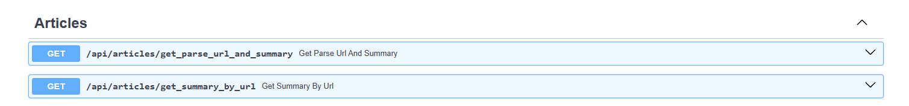
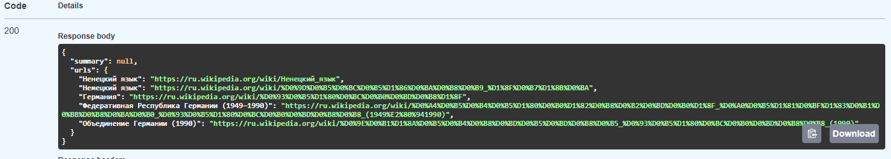
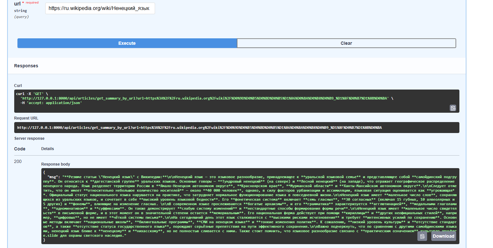

# Тестовое задание

__Само задание описано в файле - test-investera.txt__

- Для решения этого задания был разработан web-сервис на FastApi.
- БД использовалась PostgreSQL, для транзакций с БД использовалась библиотека SQLAlсhemy.
- Парсер статей с википедии был написан на Aiohttp + BeautifulSoup.
- Для составления резюме использовалась бесплатная версия нейросети qwen3-30b

Запустите сервис с помощью команд:

- `git clone https://github.com/smilee-2/WikiParser.git`

- `cd parserforwiki`

- `docker-compose up -d`

__Swagger UI__ - http://localhost:5050/docs

__Web-сервис имеет 2 эндпоинта, один для парснинга, второй для получения summary статьи.__ 

__По запросу на эндпоинт api/articles/get_parse_url_and_summary парсятся до 5 статей в глубину, а для переданной статьи формируется резюме.__

__Резюме статьи можно получить по ее url__

